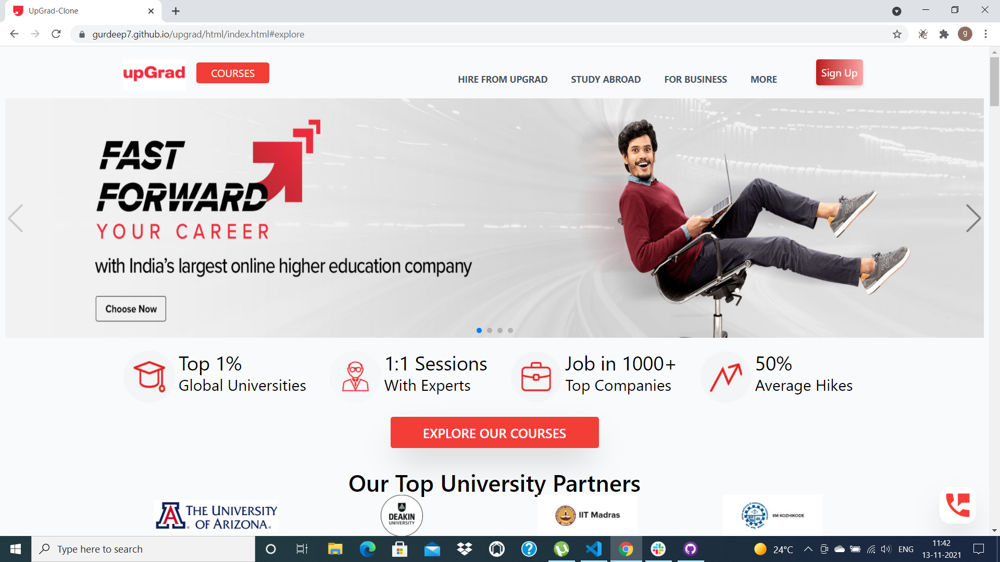

# UpGrad - Clone

>It is South Asia’s largest higher EdTech company. With the latest technology, pedagogy, industry partners and world-class faculty, They create immersive online learning experiences for our learners globally.

## Hosted Platform

https://gurdeep7.github.io/upgrad/html/index.html

## Contributors

1. Gurdeep Singh
2. Parag Raghunath Patil
3. Deepesh
4. Dinesh Kumar
5. Kapish Singh
6. Madhu Sudhanan

## Technologies Used
> 
> &ensp; 
> &ensp; 
> &ensp; 

## Snapshot from the Built Project

>   &emsp;
>  &emsp;
>  &emsp;
>  &emsp;
>  &emsp; 
>  &emsp; 
>  &emsp; 

